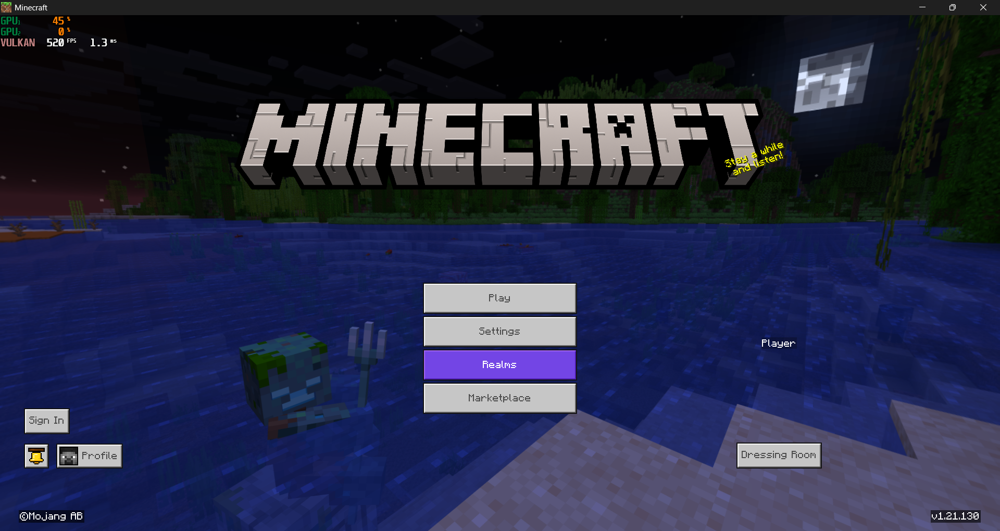

# VulkanMod-Bedrock (formerly FuckDX)


A standalone mod that forces Minecraft: Bedrock Edition (Windows) to use the Vulkan rendering backend instead of DirectX.

## Mod in Action


## Setup

### Prerequisites

- Windows 10/11
- Minecraft: Bedrock Edition for Windows (GDK version, tested on 1.21.130)
- A Vulkan 1.1+ capable GPU with up-to-date drivers
- CMake 3.20+
- Visual Studio 2022+ (MSVC)
- Python 3.10+ (for material conversion)

### Step 1: Build dxil-spirv (the shader converter)

```bash
git submodule update --init --recursive
cd external/dxil-spirv
cmake -S . -B build -G "Visual Studio 18 2026" -A x64
cmake --build build --config Release --target dxil-spirv
cd ../..
```

This produces `external/dxil-spirv/build/Release/dxil-spirv.exe`.

### Step 2: Convert material files

In PowerShell, convert and fix all materials in one go:

```powershell
$mc = (Get-AppxPackage "Microsoft.MinecraftUWP").InstallLocation
python tools/convert_materials.py "$mc\data\renderer\materials" converted_materials --jobs 8  # More jobs = faster conversion, higher CPU load
python tools/convert_materials.py fixlocs converted_materials
python tools/convert_materials.py fixbindings converted_materials
```

Or as a single copy-paste one-liner:

```powershell
$mc = (Get-AppxPackage "Microsoft.MinecraftUWP").InstallLocation; python tools/convert_materials.py "$mc\data\renderer\materials" converted_materials --jobs 8; python tools/convert_materials.py fixlocs converted_materials; python tools/convert_materials.py fixbindings converted_materials
```

### Step 3: Build the mod

```bash
cmake -S . -B build -G "Visual Studio 18 2026" -A x64
cmake --build build --config Release
```

This produces `build/Release/FuckDX.dll` (or `build/FuckDX.dll` with Ninja).

### Step 4: Install

Copy the built `FuckDX.dll` and the converted materials into the game directory. The easiest way is via PowerShell:

```powershell
$mc = (Get-AppxPackage "Microsoft.MinecraftUWP").InstallLocation
New-Item -ItemType Directory -Force "$mc\data\renderer\converted_materials"
Copy-Item build\FuckDX.dll "$mc\mods\"
Copy-Item converted_materials\* "$mc\data\renderer\converted_materials\"
```

Your folder structure should look like this after the installation:
```
<game_root>/
  Minecraft.Windows.exe
  data/
    renderer/
      materials/              (original game materials)
      converted_materials/    (our SPIRV materials)
        ActorBanner.material.bin
        Clouds.material.bin
        RenderChunk.material.bin
        ... (all 150 material files)
  mods/
    FuckDX.dll
    fuckdx.log              (created at runtime)
```

### Step 5: Launch

It is recommended that you use [ModLoader](https://github.com/QYCottage/ModLoader) to inject the DLL, as the mod has to load before the game window loads.

1. Download the latest release from [ModLoader](https://github.com/QYCottage/ModLoader/releases)
2. Copy `winhttp.dll` into your game root (next to `Minecraft.Windows.exe`)
3. Launch Minecraft normally — ModLoader will load `FuckDX.dll` from `mods/` automatically

Check `mods/fuckdx.log` if something goes wrong.

## How it works

### The problem

Minecraft Bedrock's `.material.bin` files contain compiled shaders tagged by platform (e.g. `Direct3D_SM50`). There are **no Vulkan/SPIRV shader entries**. bgfx's Vulkan renderer is present in the binary but unused — when forced on, it can't find matching shaders and the game produces no frames, causing the game to crash.

### The solution

**Offline (material conversion):**

1. The converter parses each `.material.bin` file and locates all the DXBC shader blobs (both bgfx-wrapped VSH/FSH/CSH binaries and bare DXBC entries)
2. Each DXBC blob is then converted to SPIRV using [dxil-spirv](https://github.com/HansKristian-Work/dxil-spirv)
3. SPIRV version is downgraded from 1.6 to 1.3 to broaden GPU compatibility (strips VulkanMemoryModel, DemoteToHelperInvocation, etc.)
4. Vertex input locations are remapped to match bgfx's `Attrib` enum (Position=0, TexCoord0=10, etc.)
5. Descriptor bindings are also remapped to bgfx's Vulkan scheme (VS UBO at binding 0, FS UBO at 48, samplers at stage_base+16/32+N)
6. Size fields are updated in the bgfx binary headers to account for SPIRV payload size differences

The shader entries keep their `Direct3D_SM50` platform tag, but the payload is now SPIRV.

**Runtime (DLL hooks):**

Three hooks work together:

1. **`bgfx::init` hook** — Overwrites the renderer type in the init struct to 10 (Vulkan). Disables D3D12 backend entries in the factory table to prevent fallback. After init succeeds, patches the renderer type global back to 4 (D3D12 RTX) so the material system selects DirectX-tagged entries — which now contain our converted SPIRV.

2. **`CreateFileW` hook** — Intercepts file opens for `.material.bin` and redirects them to `data/renderer/converted_materials/`, leaving the original game files untouched.

3. **`vkCmdSetViewport` hook** — Applies a negative viewport height Y-flip (`y = y + height, height = -height`) to compensate for Vulkan's inverted clip-space Y vs Direct3D. Installed via a `vkGetDeviceProcAddr` interception on the Vulkan loader, so it works without any hardcoded game offsets.

## Updating

When updating to a new Minecraft version:
1. Re-run `convert_materials.py` against the new version's material files (shader bytecode changes between versions)
2. Re-run `fixlocs` and `fixbindings` on the output
3. If the DLL fails to find signatures (check `fuckdx.log`), please open an issue attaching the log file.

## Limitations

- Materials may need to be re-converted for each game update due to shader bytecode changes
- Mojang may remove the Vulkan backend from the game altogether
- There's no support for encrypted `.material.bin` files (encryption variant must be "NONE")
- Terrain (RenderChunk) may have minor texture sampling differences due to DXBC-to-SPIRV conversion edge cases
- Mod needs to be injected before bgfx init

## Known bugs

- Entity shadows do not render
- Enabling Vibrant Visuals will crash the game

## Credits

- [dxil-spirv](https://github.com/HansKristian-Work/dxil-spirv) by Hans-Kristian Arntzen (Valve) — DXBC/DXIL to SPIRV conversion
- [MinHook](https://github.com/TsudaKageyu/minhook) — x64 function hooking
- [libhat](https://github.com/BasedInc/libhat) — signature scanning

## License

  [MIT](LICENSE)
